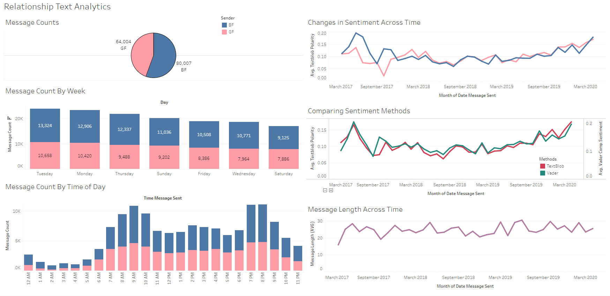
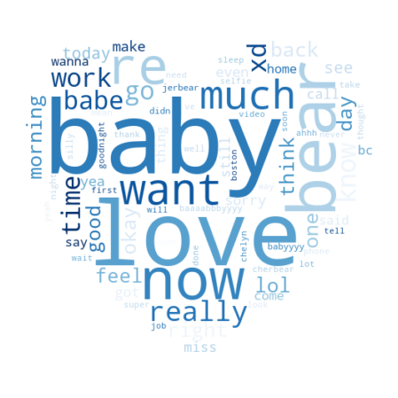
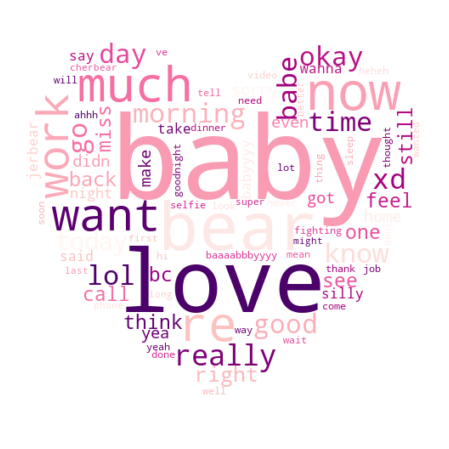

# Text Analytics

Tableau Dashboard [Link](https://public.tableau.com/views/RelationshipTextsProject/Dashboard1?:language=en&:display_count=y&publish=yes&:origin=viz_share_link)

## Project Overview
This is a text mining project to analyze messages sent from the couple's chatting app called [Between](https://between.us/?lang=en).

### Part 1: Data Cleaning and Preprocessing 
* Data was exported from the app as a text file

### Part 2: Basic EDA
### Part 3: WordClouds
### Part 4: Sentiment Analysis
### Part 5: Text Classification

### Data Visualizations

 
